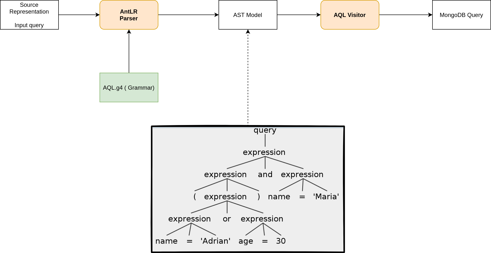

# kql-mongo-transpiler

A simple transpiler that gets a simple kibana like query language and compile it to MongoDB query language.

```java
// A simple query language...
var query = "(user.id=1 || user.age=20) and (user.name='adrian' or user.birth from ´1981-09-22 21:15:00´ to ´2020-01-01´)";

log.info(new AQLToMongoTranspiler().transpile(query));
```

Output:
```js
$and:[$and:[$or:[{'user.id': 1}, {'user.age': 20}]], $and:[$or:[{'user.name': 'adrian'}, {'user.birth': {$from:'1981-09-22 21:15:00', $to:'2020-01-01'}}]]]
```


## Diagram


